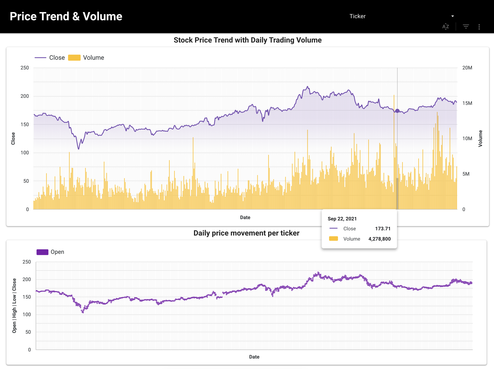

# I. Project Overview
The project goal is to build a stock data processing pipeline from multiple sources (raw/historical):

     (1) Clean and standardize data (data format, numbers, K/M notation) 
     (2) Check data quality (missing values, duplicates, outliers, consistency) 
     (3) Statistical analysis, trends, and relationships 
     (4) Create a foundation for the closing price (close_price) prediction model

## 📊 Interactive Dashboard

This project also includes an **interactive dashboard** for exploring stock data.  
You can preview it below and click the link to interact with the live version.

👉 [View Full Dashboard on Looker Studio](https://lookerstudio.google.com/reporting/xxxxxxx)

**Key   Questions:**

**1. Data Quality & Processing** 
*   How much preprocessing or standardization does raw data require before analysis?

        _ Check datatype, missing values, duplicates
        _ Standardize column names, add primary key, save clean file 

* Is the raw data consistent with the historical data based on % change? 

**2. Exploratory  Analysis**
*  Which trading days are outliers based on % change?
*  Volatility trends of each stock ticker over time?
  
         _ Stock-level trend (individual ticker performance)
         _ Sector-level trend (Bank vs Non-bank)
         _ Advanced analysis (rolling average & volatility)

**3. Relationship & Modeling**
*  Which factor affects the closing price the most? 
*  Does the predicted vs actual result of Linear Regression fit well? 

# II. Approach

*Fig 2.1. Flowchart*

# III. Tech Stack Used

*  **Spreadsheet (Google Sheets/ Excel):** Initially used for manual data cleaning (e.g., converting Volume from K/M notation to numeric values, formatting Pct_change with formulas.)
*  **SQLite:** Imported the cleaned dataset for running basic SQL queries
*  **Python (Pandas, Numpy):** Later replaced manual cleaning with Python scripts to automate preprocessing and handle data at scale (duplicates, missing values, outliers, data type conversion)
*  **MySQL:** Designed and created a dedicated database to store cleaned datasets and perform advanced queries
*  **Visualization:** Matplotlib and Seaborn for exploratory data analysis (EDA); Looker Studio for interactive dashboards
*  **Modeling:** Scikit-learn (Linear Regression, Pipeline) applied to validate relationships between input variables and closing price

# IV. Data Processing
**1. Data Collection & Overview**
*    *Dataset:* 6 files (3 raw, 3 historical) for VCB, VIB, VIC
*    *Key columns (file raw):* time, open, high, low, close, volume, ticker
*    *Key columns (file hist):* Ngày, Đóng cửa, Mở cửa, Cao nhất, Thấp nhất, Khối lượng, % Thay đổi

**2. Handling Duplicate Values**

*  **Check duplicates across all datasets:** Checked duplicates across all 6 files csv (raw/ historical) for all 3 stock tickers (VCB, VIB, VIC). No duplicate rows were found, however, when checking the specific column “Date”, all 3 raw files showed duplicate entries on Date “2022-12-27”, with Open/High/Low/Close values showing minor (insignificant) differences, but large volume discrepancies. 

*   **Solution:** Drop duplicates, keep the last row (prioritizing the row with higher volume). For the data to be joinable in both raw and historical files, duplicates must be removed, keeping the row with the larger volume (higher volume usually reflects the full and valid total trading volume (higher volume usually reflects the full and valid total trading volume) 

**3. Handling Missing Values**

_ Checked using df.isnull().sum() → no missing values detected

**4.  Error Correction & Outlier Handling**
*   **Error Correction:** Historical file – The Volume column has K, M notation in str/object format. To facilitate calculation queries, convert to numeric format (K corresponds to e3, M corresponds to e6). Example: 11.57M = 11570000, 996.80K = 996.8. Pct_change from % → float. Example: 0.33% = 0.0033.

*    **Outlier Detection:** Calculate the mean of pct change, stddev of pct change. Then find the threshold to filter out outlier days.

     _ mean(pct_change) + 2*std(pct_change) → threshold1
     
     _ mean(pct_change) -2*std(pct_change) → threshold2
     
     _ Pct change > threshold1 ~ Positive outlier
     
     _ Pct change < threshold 2 ~ Negative outlier 

*  **Result:** Most days  = Normal, some days = Outlier

*  **Visualization:** Bar chart of outlier days

*Fig 4.1. Distribution of Outlier Days*

#  V. Analysis and Results
**1. Section 1: Data Validation** 

*  **Business Question:** Is the % change in the raw and historical files consistent?
*  **Approach (Key Steps):**

   _ Calculate % change from raw data using LAG(close_price)
   _ Compare with the existing % change in the historical file
   _ Measure the difference to detect inconsistency

*  **SQL Snippet:** *“Full query available on Colab/ Appendix”*
*  **Output:** The distribution of the diff is close to 0 (for all 3 tickers, with VIC having almost no different) → data in raw and historical files is mostly consistent, with only a few minor (insignificant) discrepancies

**2. Section 2: Stock-level trend** 

*  **Business Question:** Which day did the stock increase/ decrease the most?
*  **Approach (Key steps):**

       _ Calculate % change and daily change using LAG(close_price)
       _ Use ROW_NUMBER() to rank up and rank down for each stock ticker

*  **SQL Snippet:** *“Full query available on Colab/ Appendix”*
*  **Output:** Top 5 days the stocks (VCB, VIB, VIC) increased/decreased the most

*  **Business Question:** Total trading volume monthly/quarterly?
*  **Approach (Key steps):**

           _ Calculate total volume by month using GROUP BY year, month
           _ Calculate total volume by quarter, use CASE WHEN and CONCAT(‘Q1-’, Year) to label the quarter. Sort by ticker, year and quarter_label 

*  **SQL Snippet:** *“Full query available on Colab/ Appendix”*

*  **Business Question:** How does the % change fluctuate across quarters?
*  **Approach (Key Steps):**

        _ Format to quarter, use FLOOR((month-1)/3) +1
        _ Use MAX to find the last trading day of the quarter
        _ Use JOIN to retrieve the closing price of that quarter’s last day
        _ Calculate % change using LAG(quarter_close_price)
        _ Use CASE WHEN to label the quarter 

*  **SQL Snippet:**  *“Full query available on Colab/ Appendix”*
*  **Output:** AVG of % change by quarter

**3. Section 3: Sector-level trend** 

 **Business Question:** Total trading volume of the sector, and the percentage contribution to the sector? 
 **Approach (Key steps):**

              _ JOIN the metadata table with the stock_prices_raw table to get the Sector, use GROUP BY sector
              to calculate the total trading volume of the industry  
              _ Create a CTE calculating volume by ticker and volume by sector 

*  **SQL Snippet:** *“Full query available on Colab/ Appendix”*
*  **Output:** VIB has the largest trading volume among the 2 bank sector stocks, with an insignificant difference compared to the leading ticker, VIC.  

 **Business Question:** Which sector has better performance monthly/quarterly?
**Approach (Key steps):**

               _ JOIN to retrieve the sector from the metadata table (stocks)
               _ Calculate daily change and % change using LAG(close_price)

 **SQL Snippet:** *“Full query available on Colab/ Appendix”*
 **Output:** 

              _ AVG of daily change by sector 
              _ AVG of % change by sector 

**4. Section 4:  Advanced Analysis**

 **Business Question:** Identify outlier days, volatility?
 **Approach (Key steps):**  

             _ Determine the threshold by calculating the mean and std of % change
             _ Use CASE WHEN to filter out outlier days 

 **SQL Snippet:** *“Full query available on Colab/ Appendix”*

**Output:** Most are normal days, with only a few Positive increase or Negative decrease days in the Q1-2020 period (for all 3 tickers).

**Descriptive Statistics**

**Business Question:** Basic statistics (Mean, Median, Std for Open/Close/Volume)? 
**Approach (Key steps):**

               _ Filter data by each stock ticker
               _ Use .describe() to get the basic statistical indicators

 
**Python  Snippet:** *“See Appendix or full script here for complete code”*

**Output:** Table of statistics including count, mean, std, min, max, quartiles for each stock ticker

**Correlation Analysis**

**Business Question:** Which factor has the strongest correlation with the closing price?   
**Approach (Key steps):** 

                _ Select independent vars: Open, High, Low, Volume, Pct_change
                _ Calculate correlation with Close price using .corrwith() and .corr()

**Python  Snippet:** *“See Appendix or full script here for complete code”*

**Output:** Open/ high/ low price have corr > 0.99 with the closing price, almost absolute

**Prediction Model**

**Business Question:** Can the closing price (Close Price) be predicted from the variables Open, High, Low? 
**Approach (Key steps):** 

                _ Select input variables (based on corr): open_price, high_price, low_price
                _ Use a Pipeline consisting of StandardScaler() for data standardization and LinearRegression()
                for training 
                _ Train for each stock ticker and evaluate using R^2 and MSE
                _ Compare Actual vs Predicted using a distribution chart 

**Python  Snippet:** *“See Appendix or full script here for complete code”*

**Output:** 

          * VCB - R^2 ≈ 0.997, MSE ≈ 0.34
          * VIB - R^2 ≈ 0,998, MSE ≈ 0.08
          * VIC - R^2 ≈ 0.998, MSE ≈ 0.71 

**Result:** High R², the model explains Close Price well

# VI. Insights and Visualization

**1. Data Quality and Validation**

*Fig 6.1. PCT Change (Raw vs Hist) – Consistency Check*

*Fig 6.2. Distribution of % change difference (Raw vs Hist)*

**Insight:** Data in the raw and hist files almost match, with only a few minor discrepancies for VCB and VIB tickers. The data is almost identical for the VIC ticker. Data is reliable enough for analysis.

**2. Stock-level Trends**

*Fig 6.3. Top 5 gainers/ losers by ticker (VCB)*

*[View Full Interactive Dashboard on Looker Studio](https://lookerstudio.google.com/reporting/5d6d919d-5183-4e6b-8ae0-638ccbc46fb1)*

**Insight:**  
**VCB**  
- **Largest Daily change:** +4.23 (*price increased from 67.74 → 71.97*) on 02-12-2022.  
- **Highest % change:** +6.89% on 25-03-2020, *when the closing price was only 40.33 – the lowest level among top gainers*.  
- **Strongest decrease:** 06-12-2022, *daily change -4.23 and % change -5.88%*, far exceeding the normal fluctuation range (1–2%).  
⇒ *Generally, VCB experienced strong volatility during the COVID-19 pandemic period (2020) and late 2022.*  

**VIB**  
- **Largest Daily change:** +1.76 (*closing price 27.31*) on 31-12-2021.  
- **Highest % change:** +10.84% on 06-10-2020, *far exceeding the normal level → clear outlier.*  
- **Strongest decrease:** 14-07-2021, *daily change -1.91 and % change -6.94%*, meaning a decrease of nearly 7% in a single day.  
⇒ *VIB has an extremely large % change amplitude (both up and down), indicating higher volatility than VCB.*  

**VIC**  
- **Largest Daily change:** +7.73 (*price increased from 117.32 → 125.05*) on 13-04-2021.  
- **Highest % change:** +6.99% on 25-03-2020.  
- **Strongest decrease:** 28-01-2021, *% change -7%*, meaning a 7% decrease in one session – classified as a negative outlier.  
⇒ *Compared to VCB and VIB, VIC has the highest daily change amplitude, indicating this stock fluctuates more strongly than the two bank tickers.*

*Fig 6.4. Quarterly Trading Volume by ticker (VCB)*

*[View Full Interactive Dashboard on Looker Studio](https://lookerstudio.google.com/reporting/5d6d919d-5183-4e6b-8ae0-638ccbc46fb1)*

**Insight:**  

**VCB**  
- **Trading volume peaked:** Q2-2021 (*134,256,300*).  
- **Lowest:** Q4-2023 (*20,566,600*), however, *as the data only goes up to November, it does not fully reflect the entire quarter.*  
- *Overall, VCB has relatively stable trading volume over the years, with less extreme fluctuations compared to VIB and VIC.*  

**VIB**  
- **Peaked:** Q3-2023 (*344,466,200*), *showing an explosion in liquidity during this period.*  
- **Lowest:** Q1-2021 (*47,142,400*), *potentially due to the impact of the Covid-19 pandemic context.*  
- *Notably, Q2-2023 also recorded high volume (*340,812,700*), an increase of about 62% compared to the immediately preceding quarter, showing a strong flow of capital into this stock.*  

**VIC**  
- **Volume peaked:** Q3-2023 (*733,998,200*), *surpassing other quarters and significantly higher than VCB, VIB.*  
- **Lowest:** Q3-2020 (*30,909,510*), then *steadily increased over the years.*  
- *However, VIC has the largest fluctuation among the 3 tickers, indicating strong liquidity volatility and less stability compared to the banking group (VCB, VIB).*

**3. Sector-level Trends**

*Fig 6.5. Sector Volume share*

*[View Full Interactive Dashboard on Looker Studio](https://lookerstudio.google.com/reporting/5d6d919d-5183-4e6b-8ae0-638ccbc46fb1)*

**Insight:**  

**Bank sector**  
- *VIB accounts for 66.2% of trading volume, nearly double VCB (33.8%).* **This shows VIB has higher liquidity within the same industry.**  
- *However, VCB has the highest average daily change rate (~3%), indicating that VCB stock price generally fluctuates more strongly than VIB (only ~1%).*  

**Non-bank group**  
- *VIC has the largest total trading volume (100% within the sector) but recorded a negative average daily change (-6%), reflecting a significant downward price trend during the observation period.*

**4. Advanced Analysis (Outliers & Volatility)**

*Fig 6.6. Outlier days by pct change (VCB)*

*[View Full Interactive Dashboard on Looker Studio](https://lookerstudio.google.com/reporting/5d6d919d-5183-4e6b-8ae0-638ccbc46fb1)*

**Insight:**  

**VCB**  
- *Recorded multiple consecutive negative outliers in March 2020 (decreased >–6%/day), reflecting the period when the market was heavily impacted by COVID-19.*  
- *Subsequently, positive outliers appeared in April 2020 (increased >+6%/day), showing a short-term recovery after the initial shock.*  
- *Furthermore, in 2021–2022, there were scattered days with volatility >±5% but less frequent than the early 2020 period.*  

**VIB**  
- *Multiple negative outliers appeared in 2020–2021 (decreased 6–11%/day), notably a decrease of –10.93% on 23/03/2020.*  
- *Conversely, there was a strong sequence of positive outliers from late 2020 into 2021 (continuously increased >+6%/day, peaking at 10.84% on 06/10/2020).*  
- *Notably, in Q2/2022 there were many days with increase/decrease >±6%, reflecting a period of strong market fluctuation after COVID.*  

**VIC**  
- *Most volatile among the 3 tickers: continuously having both positive and negative outliers.*  
- *March 2020: many days of deep decline (–6 to –7%), followed by a strong rebound on 25–27/03/2020 (+6–7%).*  
- *Q4/2022 – Q3/2023: concentrated many positive outliers (≈+7%), accompanied by days of deep decline (–6% to –7%).*  
- *Overall, VIC has a denser frequency of outliers than VCB and VIB → irregular price fluctuation, higher risk level.*

.png)

*Fig 6.7. VCB - Rolling Returns (7days vs. 30 days)*

*[View Full Interactive Dashboard on Looker Studio](https://lookerstudio.google.com/reporting/5d6d919d-5183-4e6b-8ae0-638ccbc46fb1)*

**Insight:**  

**VCB – Most stable in the long term**  
- *The 30-day moving average tends to decrease over time.*  
- *The 7-day fluctuation frequently crosses above and below the 30-day line, showing relatively strong short-term volatility compared to the long-term trend.*  
- *After the initial period, the 30-day rolling average gradually approaches 0 → indicating that VCB's average daily return tends to stabilize, no longer as high as before.*  

**VIB – Still maintains positive growth but high volatility**  
- *The 30-day rolling average tends to decrease but has not yet hit the 0 threshold, with the lowest point around 0.13.*  
- *This means VIB still maintains a positive average growth rate, but returns are thinning out.*  
- *The 7-day fluctuation is very strong, indicating much larger short-term volatility than VCB.*  

**VIC – Clear long-term volatile trend, high volatility risk**  
- *The 30-day rolling average declines close to 0, especially clear after the Covid-19 period.*  
- *At many points, the 7-day rolling average falls to quite deep negative levels (below -2%), reflecting significant short-term volatility risk.*  
- *Unlike VIB, VIC's long-term trend has almost no growth remaining, stabilizing around 0.*

**5. Modeling Result** 

**Insight:**  

**VCB**  
- **R² ~ 0.997, MSE ~ 0.337 → close price prediction almost perfectly matches reality.**  

**VIB**  
- **R² ~ 0.998, MSE ~ 0.079 → best model fit, very low prediction error.**  

**VIC**  
- **R² ~ 0.998, MSE ~ 0.71 → still accurate but higher error than the two VCB/VIB tickers, possibly due to VIC's stronger price volatility.**  

**Input explanation:**  
- The Linear Regression model was trained with independent variables Open, High, Low to predict the closing price of each stock ticker.  
- The result shows very high R-squared (0.997 ~ 0.998) for all 3 tickers → the model explains the closing price almost perfectly.
- The result shows the closing price directly depends on open/high/low with corr > 0.99. However, volume and pct change do not significantly influence it (with corr near 0) → investors wanting to predict short-term closing prices may only need to monitor the opening/high/low prices during the day.  
- Because the linear model is too simple, it is only suitable for verifying the relationship but does not fully reflect market factors (news, macroeconomics, investor sentiment).

# VII. Conclusion

- This project strengthened my skills in data cleaning (handling numeric formats, K/M, %), data quality checks (duplicates, outliers, consistency), statistical analysis with visualization, and building a basic Linear Regression model.
- **Key takeaway:** Clean and standardized data is the foundation of reliable analysis. 
- **Next steps:** Expand the dataset with diverse tickers and macroeconomic indicators for a more comprehensive view of the Vietnam stock market, and apply advanced forecasting models to improve price prediction and support investor decision-making.

